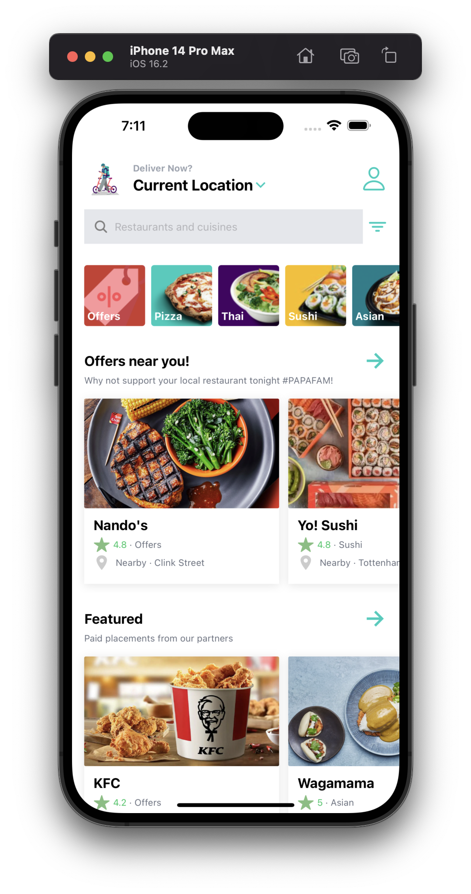
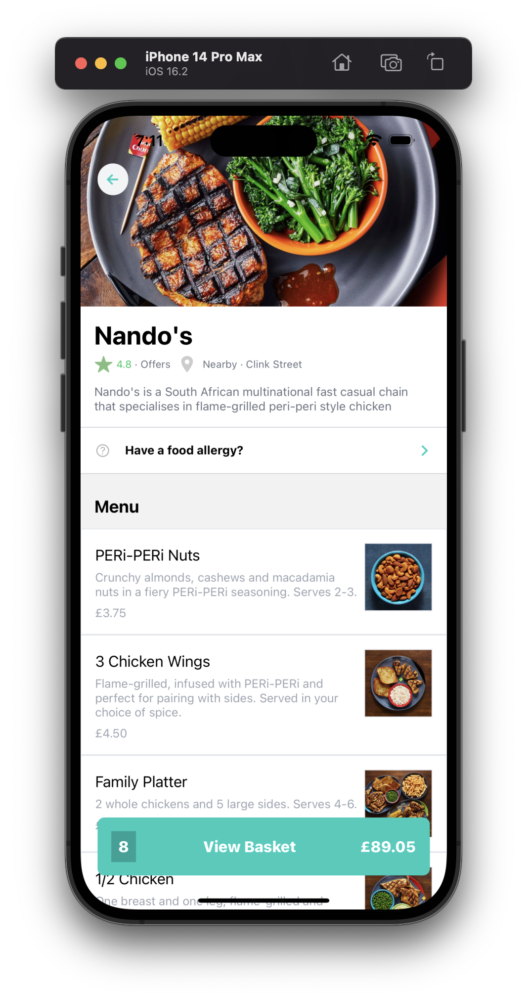
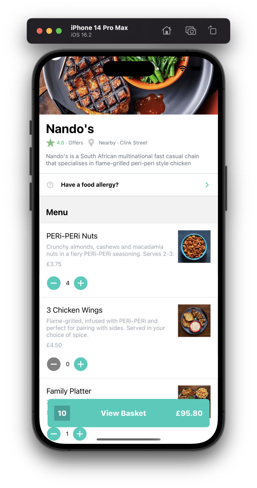
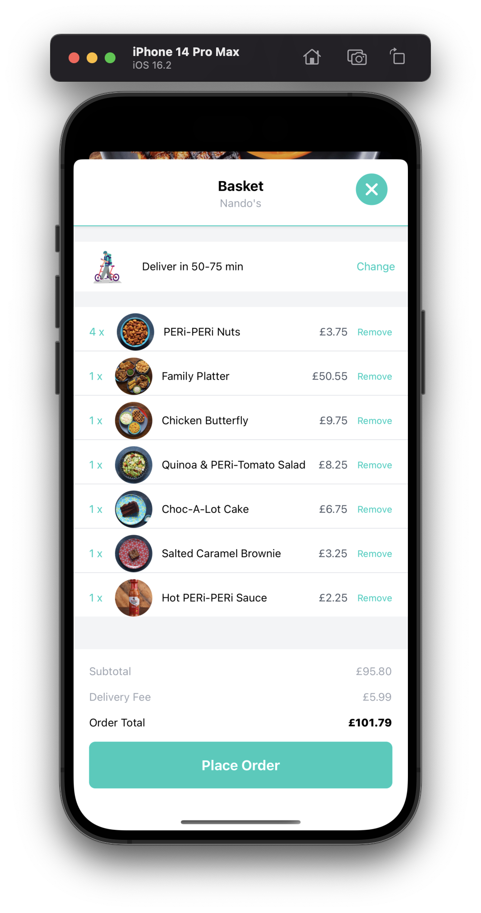
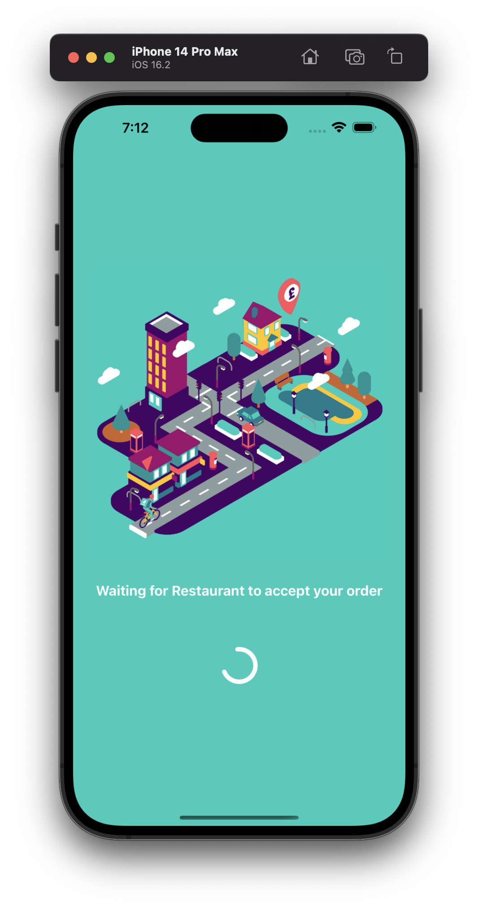
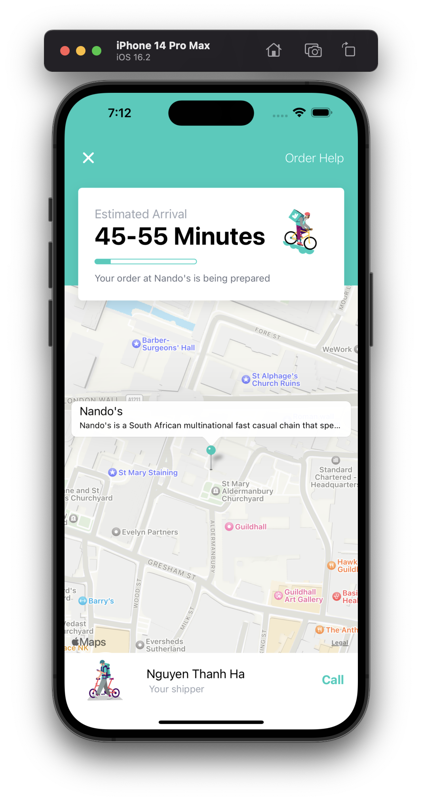

# Deliveroo clone with React-Native + Expo :motor_scooter:

### Technologies ✨

- `React-Native`
- `Expo`
- TailwindCss with `nativewind`
- `@react-navigation`
- `@reduxjs/toolkit`
- `react-native-maps` with Google Map API
- Content Management System with `sanity`

### Screenshots & video 🌃

<video src="https://github.com/ng-ha/deliveroo/assets/115610452/608bd91b-d458-4172-82f8-a7ab9e9a5854" width="100%" />

### License :right_anger_bubble:

[MIT](https://choosealicense.com/licenses/mit/)
